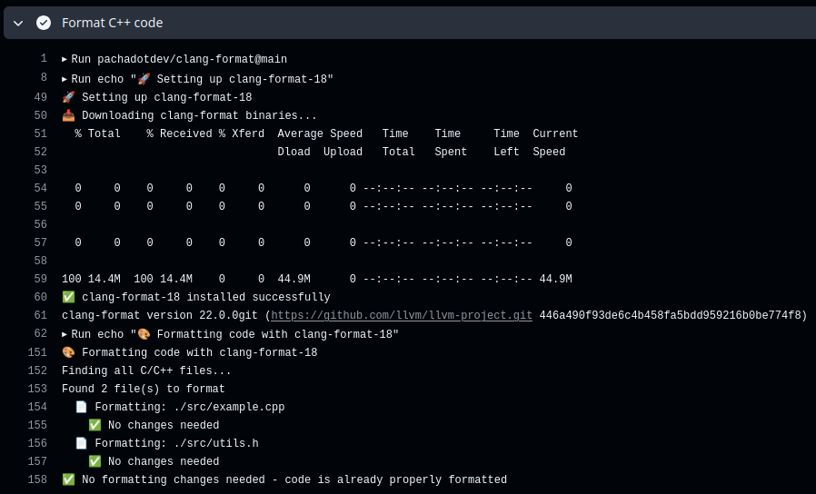

# Clang-format Action Example

If this project is useful to you, please consider supporting it by buying me a coffee: [](https://www.buymeacoffee.com/pacha)

## What this example shows

- Automatic formatting of C++ code on push/PR
- Auto-commit formatted changes back to the repository
- Multiple workflow patterns for different use cases

These are minimal examples showing how to use the [clang-format GitHub Action](https://github.com/pachadotdev/clang-format).

The details on how to build the binaries locally are here: [pachadotdev/clang-format](https://github.com/pachadotdev/clang-format).

## Files in this example

### Source Files

- `src/example.badformat` - C++ file with bad formatting
- `src/example.cpp` - auto-formatted copy of `src/example.badformat`
- `src/utils.badformat` - Header file with bad formatting
- `src/utils.h` - auto-formatted copy of `src/utils.badformat`
- `.clang-format` - Optional formatting style configuration (Google-based)

Note: the extension only modifies cpp and hpp files.

### GitHub Workflows

- `.github/workflows/format.yml` - ⭐ Minimal auto-format workflow (recommended)
- `.github/workflows/format-pr-check.yml` - PR validation workflow (check-only)
- `.github/workflows/format-specific.yml` - Manual workflow with version selection

## How it works

1. The user pushes a code with formatting issues
2. GitHub Actions run on the push/PR
3. This extension will use `clang-format-11`, `clang-format-12`, ..., or `clang-format-19` as requested to fix formatting and implement the changes in the repository

When the code is properly formatted, the action will do nothing.



## Try it yourself

1. Fork this repository
2. Make some changes to the C++ files with poor formatting
3. Add your own files and push your changes
4. Watch the action automatically format and commit the fixes

## Workflow Examples Explained

### `format.yml` - Minimal Auto-Formatting (⭐ Recommended)

What it does: Automatically formats and commits changes on every push/PR.

- ✅ Best for: Most projects wanting automatic code formatting
- 🔧 Behavior: Fixes code and commits back automatically
- 📝 Triggers: Every push to main/master/develop + PRs
  
Copy [this](https://github.com/pachadotdev/clang-format-example/blob/main/.github/workflows/format.yml) example:

```yaml
name: Auto-format C++ Code

on:
  push:
    branches: [ main, master, develop ]
  pull_request:
    branches: [ main, master, develop ]

permissions:
  contents: write
  pull-requests: write

jobs:
  format:
    runs-on: ubuntu-latest
    
    steps:
      - uses: actions/checkout@v4
        with:
          token: ${{ secrets.GITHUB_TOKEN }}
          persist-credentials: true
      
      - name: Format C++ code
        uses: pachadotdev/clang-format@main
        with:
          version: '18'
          auto-commit: true
          commit-message: 'style: auto-format C++ code with clang-format-18'
```

### `format-pr-check.yml` - PR Validation Only

What it does: Checks formatting without making changes, fails if issues found

- ✅ Best for: Enforcing code style in PRs without auto-fixing
- ❌ Behavior: Fails CI if formatting issues are detected
- 📝 Triggers: Only on pull requests
  
Copy [this](https://github.com/pachadotdev/clang-format-example/blob/main/.github/workflows/format-pr-check.yml) example:

```yaml
name: PR Format Check

on:
  pull_request:
    branches: [ main, master ]

jobs:
  check-formatting:
    runs-on: ubuntu-latest
    
    steps:
      - uses: actions/checkout@v4
      
      - name: Check C++ code formatting
        uses: pachadotdev/clang-format@v1
        with:
          version: '18'
          auto-commit: false
          fail-on-diff: true
```

### `format-specific.yml` - Manual with Options

What it does: Manual workflow with version selection and specific file targeting

- ✅ Best for: Advanced users wanting control over when/how formatting runs
- 🎛️ Behavior: Choose clang-format version (11-19) via GitHub UI
- 📝 Triggers: Manual dispatch only (Actions tab → Run workflow)
  
Copy [this](https://github.com/pachadotdev/clang-format-example/blob/main/.github/workflows/format-specific.yml) example:

```yaml
name: Format Specific Files

on:
  workflow_dispatch:
    inputs:
      clang_version:
        description: 'Clang-format version to use'
        required: true
        default: '18'
        type: choice
        options:
        - '11'
        - '12'
        - '13'
        - '14'
        - '15'
        - '16'
        - '17'
        - '18'
        - '19'

permissions:
  contents: write

jobs:
  format-specific:
    runs-on: ubuntu-latest
    
    steps:
      - uses: actions/checkout@v4
        with:
          token: ${{ secrets.GITHUB_TOKEN }}
          persist-credentials: true
      
      - name: Format specific C++ files
        uses: pachadotdev/clang-format@v1
        with:
          version: ${{ github.event.inputs.clang_version }}
          files: 'src/*.cpp src/*.h'
          auto-commit: true
          commit-message: 'style: format src/ files with clang-format-${{ github.event.inputs.clang_version }}'
```

## Quick Start Recommendation

For most projects, start with `format.yml`. It provides automatic formatting with minimal setup!

## Expected behavior

After pushing, you should see:

- ✅ Action runs successfully
- 🔧 Code gets properly formatted
- 📝 Automatic commit with formatted changes
- 🎉 Clean, consistent code style
